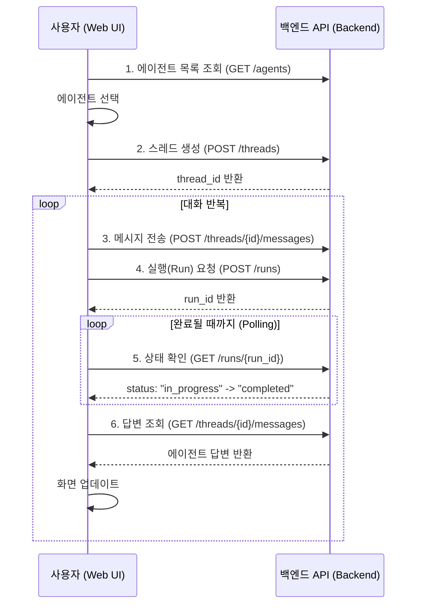

# Multi-Agent HR Onboarding System (Azure AI Agents)

이 프로젝트는 **Azure AI Agents Service** (구 Azure Foundry Agents)를 활용하여 HR 온보딩 프로세스를 자동화한 **멀티 에이전트 시스템**입니다.
FastAPI 백엔드와 React 프론트엔드로 구성되어 있으며, **Identity, IT, Training** 전문 에이전트들이 협력하여 **계획(Plan) → 승인(Approve) → 실행(Execute)** 워크플로우를 수행합니다.

## ✨ 핵심 변경 사항 및 기능

- **MCP (Model Context Protocol) 지원 추가**:
  - **4종의 MCP 서버 통합**: HR(인사), Sales(매출), Supply Chain(재고), Weather(날씨) 전문 도구를 제공하는 MCP 서버와 연동됩니다.
  - **동적 도구 등록**: 에이전트 생성 시 선택한 MCP 프로토콜의 도구들이 자동으로 Azure AI Agent의 Function Calling 도구로 등록됩니다.
  - **확장된 UI**: 프론트엔드에서 에이전트 생성 시 원하는 MCP 서비스를 체크박스로 선택할 수 있으며, 관련 예시 질문이 자동으로 프롬프트에 추가됩니다.

- **Azure AI Agents 기반 온보딩**:
  - 기존의 모의(Mock) 에이전트 대신 **실제 Azure AI Agents**를 사용하여 Identity, IT, Training 작업을 수행합니다.
  - 비동기 작업 처리 및 상태 관리를 통해 안정적인 워크플로우를 제공합니다.
  
- **워크플로우 (Plan → Approve → Execute)**:
  1. **Plan**: 사용자 입력(이름, 역할)을 분석하여 에이전트가 필요한 리소스 계획을 수립합니다.
  2. **Approve**: 사용자가 AI가 제안한 계획을 검토하고 승인합니다.
  3. **Execute**: 승인된 계획에 따라 각 에이전트가 작업을 병렬로 실행합니다.

- **에이전트 메모리 지속성 (Agent Memory)**:
  - 각 에이전트(Identity, IT, Training)와의 채팅 스레드(Thread)를 보존하여, 사용자가 언제든 이전 대화를 이어서 진행할 수 있습니다.

- **UI/UX 개선 및 현지화**:
  - 직관적인 타임라인 UI 및 Markdown 렌더링 개선.
  - 모든 에이전트 응답 및 시스템 메시지 **한국어** 지원.

## 🏗️ 아키텍처 및 기술 스택 (Architecture & Tech Stack)

### 1. MCP (Model Context Protocol) 란?

**MCP (Model Context Protocol)**는 AI 모델과 외부 시스템(데이터, 도구, 리소스) 간의 통신을 표준화하는 오픈 프로토콜입니다. 이 프로젝트는 MCP를 통해 다양한 도메인의 도구를 에이전트에게 동적으로 제공합니다.

**왜 MCP인가요? (Why MCP?)**
AI 에이전트를 개발할 때 가장 큰 병목은 "통합(Integration)"입니다.
- **기존 방식**: 날씨 API, HR DB, CRM 시스템 각각에 맞춰 별도의 연동 코드와 함수 정의(Function Definition)를 작성해야 했습니다.
- **MCP 방식**: 모든 서비스가 MCP 표준(예: `tools/list`, `resources/read`)을 준수하므로, 단 하나의 클라이언트 구현만으로 무한한 확장성을 가집니다. 새로운 도구가 필요하면 코드를 수정하는 대신 새로운 MCP 서버를 켜기만 하면 됩니다.

### 2. 프로젝트 아키텍처 (Architecture)

이 샘플은 **MCP Host**와 **MCP Server** 구조로 동작합니다.

*   **MCP Host (Backend API)**:
    *   `src/backend/mcp_manager.py`가 MCP 클라이언트 역할을 수행합니다.
    *   에이전트가 생성될 때, 사용자가 선택한 MCP 서버에 접속하여 사용 가능한 도구(Tools) 목록을 조회합니다.
    *   이 도구들을 Azure AI Agent가 이해할 수 있는 OpenAI Function Calling 포맷으로 자동 변환하여 등록합니다.

*   **MCP Servers (Python Implementations)**:
    각 서버는 독립적인 프로세스로 실행되며 SSE (Server-Sent Events)를 통해 통신합니다.

    | 서버 이름 | 포트 | 주요 기능 (Tools) | 데이터 소스 |
    | :--- | :--- | :--- | :--- |
    | **HR Policy** | 8003 | `get_hiring_policy`(채용 정책), `check_employee_leave`(휴가 잔여일) | `policy.md`, `employees.json` |
    | **Sales CRM** | 8001 | `get_customer_profile`(고객 정보), `get_sales_leads`(영업 기회) | `customers.json` |
    | **Supply Chain** | 8002 | `check_inventory`(재고 확인), `track_shipment`(배송 추적) | `inventory.json` |
    | **Weather** | 8004 | `get_current_weather`(날씨 조회), `get_forecast`(예보 조회) | Mock Data |

### 3. 기술 스택 (Tech Stack)

**Backend**
- **Language**: Python 3.10+
- **Framework**: FastAPI (Async support)
- **AI SDK**: Azure AI Projects Client (Agent Framework)
- **Protocol**: Model Context Protocol (MCP) Client Implementation
- **Architecture**: Modular Routers & Service-based design

**Frontend**
- **Framework**: React 18, TypeScript
- **Build Tool**: Vite
- **Styling**: Tailwind CSS
- **Components**: Custom UI Components, Lucide Icons
- **Integration**: REST API Client for Backend Communication

### 4. 실행 흐름 (Execution Flow)

사용자가 **"김철수 직원의 남은 휴가 일수를 알려줘"**라고 질문했을 때의 처리 과정입니다.

1.  **Intent**: Azure AI Agent가 질문을 분석하고 `check_employee_leave(name="김철수")` 도구 호출이 필요하다고 판단합니다.
2.  **Request**: 에이전트는 백엔드(Host)에 함수 실행을 요청(Requires Action)합니다.
3.  **Routing**: 백엔드는 이 요청이 'HR Policy' MCP 서버의 도구임을 식별합니다.
4.  **Call**: 백엔드(MCP Client)가 `localhost:8003` (HR Server)으로 `tools/call` 요청을 보냅니다.
5.  **Response**: HR 서버가 JSON 파일에서 김철수의 정보를 찾아 `{ "leave_balance": 15 }`를 반환합니다.
6.  **Answer**: 에이전트가 이 데이터를 바탕으로 "김철수님의 남은 휴가는 15일입니다."라고 대답합니다.

## 📁 프로젝트 구조 (업데이트됨)

```
src/
    backend/          # FastAPI 백엔드 (Port: 8000)
        routers/
            agents.py    # 에이전트 관리 (Azure AI Agent 연동)
            workflows.py # HR 온보딩 워크플로우 로직
            ...
        mcp_manager.py   # MCP 서버 연결 및 도구 변환 로직
        client.py        # Azure AI Project Client 설정
        main.py          # 앱 진입점

    frontend/         # React + Vite 프론트엔드 (Port: 5173)
        src/
            App.tsx      # 메인 대시보드 (Chat & Workflow UI)
            api/         # 백엔드 연동 API 모듈
            ...

    mcp/              # MCP (Model Context Protocol) 서버 그룹
        mcp-hr-policy/    # HR 정책 및 직원 휴가 데이터 (Port: 8003)
        mcp-sales-crm/    # 판매 데이터 및 CRM (Port: 8001)
        mcp-supply-chain/ # 재고 및 공급망 데이터 (Port: 8002)
        mcp-weather/      # 실시간 날씨 정보 (Port: 8004)

start_all.ps1         # 전체 시스템 원클릭 시작 스크립트
stop_all.ps1          # 시스템 종료 및 프로세스 정리 스크립트
tests/                # 백엔드 테스트 코드
```

## ✅ 사전 요구 사항 (Prerequisites)

- Python 3.9 이상
- Node.js 18+ 및 npm

## 🚀 간편 실행 (Quick Start)

필수 패키지가 설치된 후, PowerShell 스크립트로 전체 시스템을 손쉽게 제어할 수 있습니다.

> **사전 준비**: 최초 실행 전 아래의 [수동 설치 및 실행](#수동-설치-및-실행-manual-installation) 섹션을 참고하여 Python(`requirements.txt`) 및 Node(`package.json`) 의존성을 먼저 설치해주세요.

**1. 전체 서비스 시작**
```powershell
.\start_all.ps1
```
- **MCP 서버 4종** (Sales, Supply, HR, Weather)
- **Backend API Server** (Port 8000)
- **Frontend Development Server** (Port 5173)
- 위 서비스들이 각각 별도의 터미널 창에서 실행됩니다.

**2. 전체 서비스 종료**
```powershell
.\stop_all.ps1
```
- 실행된 모든 Python 및 Node.js 프로세스를 안전하게 종료하고 터미널 창을 닫습니다.

## 🛠️ 수동 설치 및 실행 (Manual Installation)

### 1 필수 환경 변수 설정

이 프로젝트는 **Azure AI Projects** 및 **Azure OpenAI** 서비스를 사용합니다. 실행 전 환경 변수 설정이 필요합니다.

`src/backend/.env` 파일을 생성하고 다음 정보를 입력하세요:

```ini
AZURE_AI_PROJECT_CONNECTION_STRING="your-azure-ai-project-connection-string"
```

> **참고**: Connection String은 Azure AI Foundry 포털의 프로젝트 설정에서 확인할 수 있습니다.

### 2. 백엔드 설치 및 실행

```powershell
# 가상환경 생성 및 활성화
python -m venv .venv
.\.venv\Scripts\Activate.ps1

# 의존성 설치 및 서버 실행
pip install -r requirements.txt
uvicorn src.backend.main:app --reload
```

서버가 정상적으로 실행되면:

```
INFO:     Uvicorn running on http://127.0.0.1:8000
...
Agent Framework API 서버를 시작합니다...
API 문서 (Swagger UI): http://localhost:8000/docs
```

### 3. 프론트엔드 설치 및 실행

```bash
cd src/frontend
npm install
npm run dev 
# or 
npm run dev --prefix src/frontend
```

### 4. MCP 서버 실행 (필수)

에이전트가 도구를 사용하려면 해당 MCP 서버가 실행되어 있어야 합니다. (별도의 터미널에서 실행하거나 `start_all.ps1` 사용)

```bash
# 환경 변수 설정 (PowerShell)
$env:PYTHONPATH='.'

# 1. HR Policy Server (Port: 8003)
python src/mcp/mcp-hr-policy/hr_server.py --sse

# 2. Sales CRM Server (Port: 8001)
python src/mcp/mcp-sales-crm/sales_server.py --sse

# 3. Supply Chain Server (Port: 8002)
python src/mcp/mcp-supply-chain/supply_server.py --sse

# 4. Weather Server (Port: 8004)
python src/mcp/mcp-weather/weather_server.py --sse
```

## 📖 API 명세 및 개발 가이드 (API & Development)

서버 실행 후 웹 브라우저에서 다음 주소로 API 문서를 확인할 수 있습니다.

- **Swagger UI**: http://localhost:8000/docs
- **ReDoc**: http://localhost:8000/redoc

### 주요 API 엔드포인트

| 컴포넌트 | 경로 (Prefix) | 설명 |
| :--- | :--- | :--- |
| **System** | `/api/v1` | 서버 상태, 헬스 체크(`/health`), 메트릭(`/telemetry/metrics`) |
| **Files** | `/api/v1/files` | 파일 업로드/목록/삭제 |
| **Agents** | `/api/v1/agents` | AI 에이전트 생성/조회/수정/삭제 |
| **Threads** | `/api/v1/threads` | 대화방(스레드) 생성/조회/삭제, 메시지 관리 |
| **Runs** | `/api/v1/threads/{thread_id}/runs` | 에이전트 실행 및 상태 조회 |
| **Workflows** | `/api/v1/workflows` | 워크플로우 목록/실행/상태 |

### 컴포넌트 관계 및 개념

* **Agents (두뇌 & 도구):** "누가 일할 것인가?"를 정의합니다. 모델, 시스템 지시사항, 사용할 도구 설정을 담고 있습니다.
* **Threads (기억 & 대화):** "어디서 이야기할 것인가?"를 정의합니다. 대화 기록을 저장하는 상태 공간입니다.
* **Runs (실행 & 처리):** "작업을 수행해라"라는 명령입니다. 작업 처리 및 응답 생성을 트리거합니다.
* **Files (지식 & 데이터):** 에이전트가 분석하거나 참고할 문서입니다.
* **Workflows (오케스트레이션):** 복잡한 업무 프로세스나 여러 에이전트의 협업을 정의합니다.

### UI 개발을 위한 API 호출 순서 (Flow for UI Dev)

웹 프론트엔드에서 **AI 채팅 애플리케이션**을 구현할 때의 상세 API 호출 흐름입니다.

**예시 시나리오: "매출 보고서를 분석해주는 AI 비서"**

1. `Files API`로 `sales_data.csv` 업로드
2. `Agents API`로 '데이터 분석가' 에이전트 생성
3. `Threads API`로 새 스레드 생성, 질문 메시지 추가
4. `Runs API`로 실행 요청 (Agent + Thread)
5. `Runs API`로 상태 확인, `Threads API`로 답변 메시지 조회

**요약 흐름도 (Sequence Diagram)**



## 🖥️ 프론트엔드 주요 기능

- 에이전트 선택 및 생성 (MCP 도구 동적 선택)
- 대화방(스레드) 생성 및 메시지 전송
- 파일 첨부 및 업로드
- AI 응답 실시간 확인
- Markdown 렌더링 지원

## 🧪 테스트 (Testing)

### 백엔드 테스트 실행 방법

테스트는 `pytest`를 사용하여 실행하며, Windows 환경에서는 PYTHONPATH를 지정해야 합니다.

#### 가상환경 활성화 및 테스트 실행 (PowerShell)

```powershell
cd src/backend
.\.venv\Scripts\Activate.ps1
$env:PYTHONPATH='.'; pytest tests
```

#### 테스트 결과
모든 테스트가 통과하면 성공 메시지가 출력됩니다.

> **주의**: 테스트는 실제 Azure 리소스를 생성하고 삭제할 수 있으므로 과금 및 리소스 제한에 주의하세요.

## 📚 참고 및 문의 (References & Contact)

- [API_SPECIFICATION.md](API_SPECIFICATION.md): 전체 API 명세
- `/src/frontend/README.md`: 프론트엔드 개발 가이드

