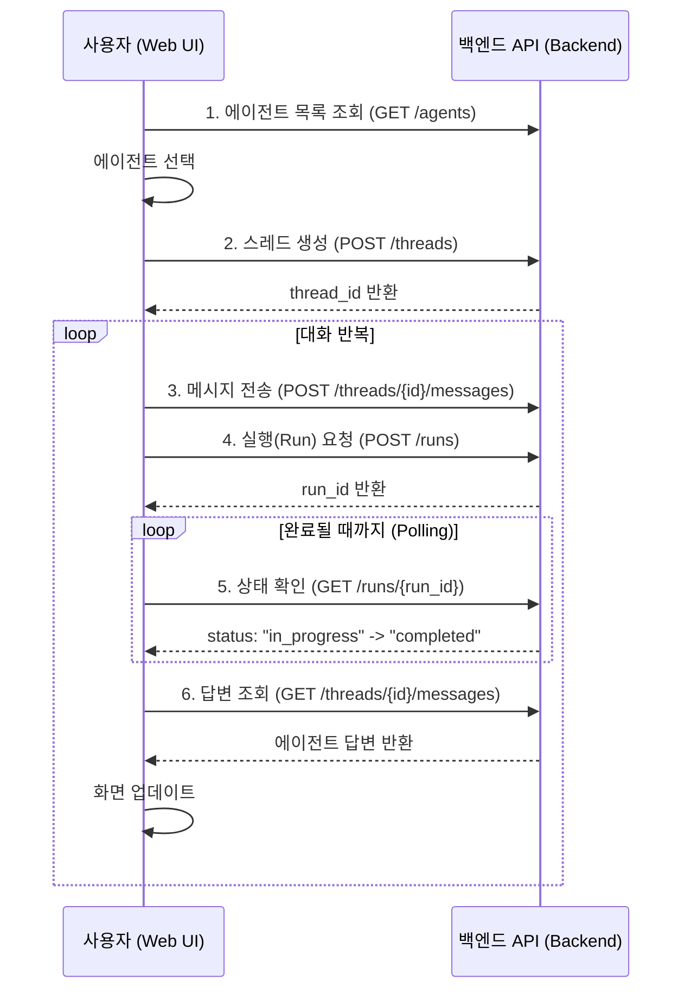

# Microsoft Agent Framework Sample

이 프로젝트는 **Microsoft Agent Framework** 기반의 AI 백엔드 및 프론트엔드 샘플입니다. FastAPI로 구축된 RESTful API와 React+Vite 기반의 웹 UI를 제공합니다.

## 프로젝트 구조

```
src/
    backend/       # FastAPI 백엔드 (API, 데이터모델, 라우터)
        routers/     # API 라우터 (agents, threads, runs, files, workflows, system)
        main.py      # FastAPI 앱 진입점
        models.py    # Pydantic 데이터 모델
        database.py  # 인메모리 DB (Mock)
    frontend/      # React + TypeScript + Vite 프론트엔드
        src/         # 주요 프론트엔드 소스
            api/       # API 클라이언트
            types/     # 타입 정의
            ...
tests/           # pytest 기반 백엔드 테스트
uploads/         # 업로드 파일 저장소
```

## 사전 요구 사항 (Prerequisites)

- Python 3.9 이상
- Node.js 18+ 및 npm

---

## 설치 및 실행

### 백엔드 설치 및 실행

```bash
cd src/backend
python -m venv .venv
# Windows
.\.venv\Scripts\Activate.ps1
pip install -r requirements.txt
uvicorn src.backend.main:app --reload
```

서버가 정상적으로 실행되면:

```
INFO:     Uvicorn running on http://127.0.0.1:8000
...
Agent Framework API 서버를 시작합니다...
API 문서 (Swagger UI): http://localhost:8000/docs
```

### 프론트엔드 설치 및 실행

```bash
cd src/frontend
npm install
npm run dev
```

---

## API 명세 및 주요 기능

서버 실행 후 웹 브라우저에서 다음 주소로 API 문서를 확인할 수 있습니다.

- **Swagger UI**: http://localhost:8000/docs
- **ReDoc**: http://localhost:8000/redoc

### 주요 API 엔드포인트

| 컴포넌트 | 경로 (Prefix) | 설명 |
| :--- | :--- | :--- |
| **System** | `/api/v1` | 서버 상태, 헬스 체크(`/health`), 메트릭(`/telemetry/metrics`) |
| **Files** | `/api/v1/files` | 파일 업로드/목록/삭제 |
| **Agents** | `/api/v1/agents` | AI 에이전트 생성/조회/수정/삭제 |
| **Threads** | `/api/v1/threads` | 대화방(스레드) 생성/조회/삭제, 메시지 관리 |
| **Runs** | `/api/v1/threads/{thread_id}/runs` | 에이전트 실행 및 상태 조회 |
| **Workflows** | `/api/v1/workflows` | 워크플로우 목록/실행/상태 |

#### 상세 흐름 및 활용 예시

이 시스템의 핵심 흐름은 **"특정 에이전트(Agent)를 대화방(Thread)에 불러와서 실행(Run)시킨다"**는 것입니다.

**예시: "매출 보고서를 분석해주는 AI 비서"**

1. `Files API`로 `sales_data.csv` 업로드
2. `Agents API`로 '데이터 분석가' 에이전트 생성
3. `Threads API`로 새 스레드 생성, 질문 메시지 추가
4. `Runs API`로 실행 요청 (Agent + Thread)
5. `Runs API`로 상태 확인, `Threads API`로 답변 메시지 조회

#### 컴포넌트 관계 및 상세 설명

* **Agents (두뇌 & 도구):** 모델(예: GPT-4), 시스템 지시사항(페르소나), 사용할 도구(Tools) 설정
* **Threads (기억 & 대화):** 사용자와 에이전트 간의 대화 기록(Messages) 저장
* **Runs (실행 & 처리):** 특정 Thread의 대화 내용을 바탕으로 Agent가 응답 생성
* **Files (지식 & 데이터):** 에이전트가 분석하거나 참고할 문서
* **Workflows (오케스트레이션):** 복잡한 업무 프로세스나 여러 에이전트의 협업 정의

#### UI 개발을 위한 API 호출 순서

웹 프론트엔드에서 **AI 채팅 애플리케이션**을 구현할 때의 상세 API 호출 흐름입니다.

1. 에이전트 목록 조회 (`GET /api/v1/agents`)
2. 스레드 생성 (`POST /api/v1/threads`)
3. 메시지 전송 (`POST /api/v1/threads/{thread_id}/messages`)
4. 실행 요청 (`POST /api/v1/runs`)
5. 상태 확인 (`GET /api/v1/runs/{run_id}`)
6. 답변 조회 (`GET /api/v1/threads/{thread_id}/messages`)

**요약 흐름도 (Sequence Diagram)**



---

## 프론트엔드 주요 기능

- 에이전트 선택 및 생성
- 대화방(스레드) 생성 및 메시지 전송
- 파일 첨부 및 업로드
- AI 응답 실시간 확인

---

## 테스트 (Testing)

### 백엔드 테스트 실행 방법

테스트는 pytest로 실행하며, Windows 환경에서는 PYTHONPATH를 반드시 프로젝트 루트로 지정해야 합니다.

#### 1. 가상환경 활성화 및 테스트 실행 (Windows PowerShell)

```powershell
cd src/backend
.\.venv\Scripts\Activate.ps1
$env:PYTHONPATH='C:/workspace/microsoft-agent-framework-agent-sample'; pytest tests
```

#### 2. (Linux/macOS)

```bash
cd src/backend
source .venv/bin/activate
PYTHONPATH=$(pwd)/../.. pytest tests
```

#### 3. 테스트 결과
모든 테스트가 통과하면 아래와 같이 출력됩니다:

```
============================= test session starts =============================
... (생략) ...
============================== 7 passed in XXs ===============================
```

#### 참고
- PYTHONPATH를 지정하지 않으면 'No module named src' 오류가 발생할 수 있습니다.
- 자세한 경고/에러는 pytest 출력에서 확인하세요.

---

## 참고 및 문서

- [API_SPECIFICATION.md](API_SPECIFICATION.md): 전체 API 명세
- `/src/frontend/README.md`: 프론트엔드 개발 참고

---

## 문의 및 기여

- [GitHub Issues](https://github.com/bmtjpark/microsoft-agent-framework-agent-sample/issues)

자세한 API 스펙은 [API_SPECIFICATION.md](API_SPECIFICATION.md) 참고

---

## 예시 시나리오 (Sample Usage)

**"매출 보고서를 분석해주는 AI 비서"**

1. `Files API`로 `sales_data.csv` 업로드
2. `Agents API`로 '데이터 분석가' 에이전트 생성
3. `Threads API`로 새 스레드 생성, 질문 메시지 추가
4. `Runs API`로 실행 요청 (Agent + Thread)
5. `Runs API`로 상태 확인, `Threads API`로 답변 메시지 조회

---

## 프론트엔드 주요 기능

- 에이전트 선택 및 생성
- 대화방(스레드) 생성 및 메시지 전송
- 파일 첨부 및 업로드
- AI 응답 실시간 확인

---


## 테스트 (Testing)

### 백엔드 테스트 실행 방법

테스트는 pytest로 실행하며, Windows 환경에서는 PYTHONPATH를 반드시 프로젝트 루트로 지정해야 합니다.

#### 1. 가상환경 활성화 및 테스트 실행 (Windows PowerShell)

```powershell
cd src/backend
.\.venv\Scripts\Activate.ps1
$env:PYTHONPATH='C:/workspace/microsoft-agent-framework-agent-sample'; pytest tests
```

#### 2. (Linux/macOS)

```bash
cd src/backend
source .venv/bin/activate
PYTHONPATH=$(pwd)/../.. pytest tests
```

#### 3. 테스트 결과
모든 테스트가 통과하면 아래와 같이 출력됩니다:

```
============================= test session starts =============================
... (생략) ...
============================== 7 passed in XXs ===============================
```

#### 참고
- PYTHONPATH를 지정하지 않으면 'No module named src' 오류가 발생할 수 있습니다.
- 자세한 경고/에러는 pytest 출력에서 확인하세요.

---

## 참고 및 문서

- [API_SPECIFICATION.md](API_SPECIFICATION.md): 전체 API 명세
- `/src/frontend/README.md`: 프론트엔드 개발 참고

---

문의 및 기여: [GitHub Issues](https://github.com/bmtjpark/microsoft-agent-framework-agent-sample/issues)

## API 문서 및 기능 (API Documentation)

서버 실행 후 웹 브라우저에서 다음 주소로 접속하여 API 문서를 확인할 수 있습니다.

- **Swagger UI**: [http://localhost:8000/docs](http://localhost:8000/docs)
- **ReDoc**: [http://localhost:8000/redoc](http://localhost:8000/redoc)

### 주요 API 엔드포인트 및 활용 (Key Concepts & Usage)

이 시스템의 핵심 흐름은 **"특정 에이전트(Agent)를 대화방(Thread)에 불러와서 실행(Run)시킨다"**는 것입니다.

#### 1. 컴포넌트 간의 관계 (Relationships)

*   **Agents (두뇌 & 도구):** "누가 일할 것인가?"를 정의합니다. 모델(예: GPT-4), 시스템 지시사항(페르소나), 사용할 도구(Tools) 설정을 담고 있습니다.
*   **Threads (기억 & 대화):** "어디서 이야기할 것인가?"를 정의합니다. 사용자와 에이전트 간의 대화 기록(Messages)을 저장하는 상태 공간입니다.
*   **Runs (실행 & 처리):** "작업을 수행해라"라는 명령입니다. 특정 **Thread**의 대화 내용을 바탕으로 특정 **Agent**가 응답을 생성하도록 트리거합니다.
*   **Files (지식 & 데이터):** 에이전트가 분석하거나 참고할 문서입니다.
*   **Workflows (오케스트레이션):** 단순 대화를 넘어, 복잡한 업무 프로세스나 여러 에이전트의 협업을 정의하는 상위 개념입니다.

#### 2. 활용 시나리오 (Usage Scenario)

**예시: "매출 보고서를 분석해주는 AI 비서"**

1.  **준비 (Files & Agents)**:
    *   `Files API`로 `sales_data.csv` 업로드.
    *   `Agents API`로 '데이터 분석가' 에이전트 생성 (지시사항 부여, 파일 연결).
2.  **대화 시작 (Threads)**:
    *   `Threads API`로 새 스레드 생성.
    *   사용자 질문("올해 매출 추세 그려줘")을 메시지로 추가.
3.  **실행 (Runs)**:
    *   `Runs API`로 실행 요청 (Agent + Thread).
    *   에이전트가 내부적으로 파일 분석 및 생각(Thinking) 수행.
4.  **결과 확인**:
    *   `Runs API`로 상태 확인 (`completed` 될 때까지).
    *   `Threads API`로 에이전트가 작성한 답변(메시지) 조회.

#### 3. API별 상세 역할 및 활용

| API 컴포넌트 | 경로 (Prefix) | 역할 및 주요 기능 | 활용 예시 |
| :--- | :--- | :--- | :--- |
| **System** | `/api/v1` | **서버 상태 관리**<br>- 헬스 체크 (`/health`), 버전 정보 | 로드 밸런서 체크 |
| **Files** | `/api/v1/files` | **파일 자산 관리**<br>- 파일 업로드/삭제/목록 | 분석할 CSV 데이터, 검색(RAG)할 PDF 문서 관리 |
| **Agents** | `/api/v1/agents` | **AI 페르소나 정의**<br>- 모델, 프롬프트, 도구 설정 | '코딩 도우미', '고객 상담원' 등 특화 에이전트 생성 |
| **Threads** | `/api/v1/threads` | **대화 맥락 관리**<br>- 스레드 생성, 메시지 관리 | 사용자 세션별 대화방 생성 및 기록 유지 |
| **Runs** | `/api/v1/runs` | **추론 엔진 트리거**<br>- 에이전트 실행 및 모니터링 | 질문에 대한 답변 생성 요청 |
| **Workflows** | `/api/v1/workflows` | **복합 프로세스 관리**<br>- 다단계 작업 정의 | '요약 -> 번역 -> 이메일 발송' 자동화 |

#### 4. UI 개발을 위한 API 호출 순서 (API Flow for UI Development)

웹 프론트엔드에서 **AI 채팅 애플리케이션**을 구현할 때의 상세 API 호출 흐름입니다.

**1. 준비 단계 (Initial Setup)**
사용자가 대화할 대상을 선택하거나 설정하는 단계입니다.
*   **에이전트 목록 조회** (`GET /api/v1/agents`)
    *   화면에 표시할 에이전트 목록을 불러옵니다.
    *   사용자가 특정 에이전트(ID:`agent_123`)를 선택합니다.

**2. 대화 시작 (Session Start)**
사용자가 "새 채팅" 버튼을 눌렀을 때의 동작입니다.
*   **스레드 생성** (`POST /api/v1/threads`)
    *   빈 대화방을 생성하고 `thread_id` (예: `thread_abc123`)를 반환받습니다.
    *   이 ID를 프론트엔드 상태(State)에 저장합니다.

**3. 메시지 교환 루프 (Interaction Loop)**
사용자가 메시지를 입력하고 답변을 받는 핵심 과정입니다.

*   **Step A: 메시지 전송** (`POST /api/v1/threads/{thread_id}/messages`)
    *   사용자가 입력한 텍스트를 스레드에 저장합니다.
    *   Payload: `{ "role": "user", "content": "안녕하세요!" }`
    *   화면에 사용자의 말풍선을 즉시 표시합니다.

*   **Step B: 실행 요청 (Run)** (`POST /api/v1/runs`)
    *   에이전트에게 답변 생성을 요청합니다.
    *   Payload: `{ "agent_id": "agent_123" }`
    *   **응답**: `run_id`와 초기 상태 `queued`를 받습니다.

*   **Step C: 상태 확인 (Polling)** (`GET /api/v1/runs/{run_id}`)
    *   답변 생성이 완료될 때까지 주기적으로(예: 1초 간격) 호출합니다.
    *   `status` 값을 확인합니다:
        *   `queued` / `in_progress`: 계속 대기 (로딩 표시)
        *   `completed`: 완료 -> **다음 단계로 이동**
        *   `failed`: 에러 처리

*   **Step D: 답변 표시** (`GET /api/v1/threads/{thread_id}/messages`)
    *   `completed` 상태가 되면 메시지 목록을 다시 조회합니다.
    *   새로 추가된 `assistant` 역할의 메시지를 화면에 표시합니다.

**요약 흐름도 (Sequence Diagram)**


## 테스트 (Testing)

`pytest`를 사용하여 작성된 테스트 코드를 실행할 수 있습니다:

```bash
pytest
```
